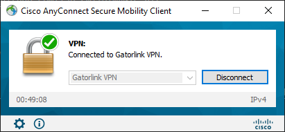
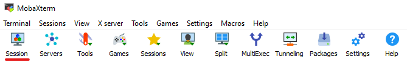
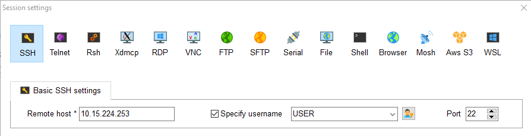

# Running MAGIC on the GPU server
This is a step-by-step guide to run MAGIC on the lab's server from scratch. This guide assumes you at least have a lab account and GitHub account to access the appropriate files. 
- If MAGIC and Anaconda are installed and you want to start training, [skip here](#run-magic).
```
Any commands you need to enter will be in these code blocks
```

## Login to the UF VPN
1. Download and login to the [Cisco UF VPN](https://it.ufl.edu/ict/documentation/network-infrastructure/vpn/)

<center>  </center>

## Access the GPU server
We can access the lab server using a secure shell (ssh) through a local terminal or [MobaXTerm](https://mobaxterm.mobatek.net/download-home-edition.html). Whenever you see, **USER**, replace with your username for the lab server.

### via Terminal
1. Access the server with your username
```
ssh USER@10.15.224.253
```
2. Enter your password once prompted. You will not see your password as you type, but it is there.

### via MobaXTerm
1. Click the Session button.

<center>  </center>

2. Select SSH.
3. Check the **Specify username** box and enter the following details.
- Remote host *: 10.15.224.253
- Specify username: USER

<center>  </center>

4. Click Ok.
5. Enter your password once prompted. You will not see your password as you type, but it is there.

## Clone MAGIC
1. Navigate to your folder.
```
cd home/USER/
```
2. Clone the MAGIC folder into the current directory.
```
git clone https://github.com/lab-smile/MAGIC.git
```
3. Enter your GitHub username.
4. Enter your personal access token. This acts as your password. If you do not have one, [generate a new one on GitHub](#personal-access-token).

## Install Anaconda
1. Download the Anaconda 3 installer.
```
wget https://repo.continuum.io/archive/Anaconda3-2022.05-Linux-x86_64.sh
```
2. Run the installer.
```
bash Anaconda3-2022.05-Linux-x86_64.sh
```
3. Hit Enter after reviewing the license agreement.
4. Hold Enter to scroll down to accept the license terms.
5. Type in **yes** to accept.
6. Hit Enter to confirm installation of Anaconda 3. The default is */home/USER/anaconda3*.
7. The installer prompts Do you wish the installer to initialize Anaconda3 by running conda init?". Type **"Yes"** to agree.

## Activate Anaconda and the MAGIC Environment
1. Add **conda** to the PATH environment variable. Note that this is only for the current session. If you relog you will need to run this code again.
```
. ~/anaconda3/etc/profile.d/conda.sh
```
2. Verify that **conda** works
```
conda info
```
3. Download the magic_env.yml into the current directory (/home/USER/)
4. Re-create the environment. [There were a few updates to the environment](#changes-to-magicenvyml).
```
conda env create -f magic_env.yml
```
5. Activate the environment
```
conda activate py3-2
```
Your command line will now precede with `(py3-2)`. You can check the environments with `conda env list`

## Run MAGIC
1. Change directory to the gpu folder
```
cd /home/USER/MAGIC/src/gpu/
```
2. Train a model on the sample data
```
python pytorch_pix2pix.py --dataset '../sample' --lrG 0.00005 --lrD 0.00005 --train_epoch 50 --save_root 'results'
```

3. Test the model on sample data
```
python pytorch_pix2pix_test.py --dataset '../sample' --model_path '../sample_generator_param_final.pkl'
```
Alternatively, change ``model_path`` to use a pretrained model.
```
python pytorch_pix2pix_test.py --dataset '../sample' --model_path '../MAGIC_Generator_FINAL.pkl'
``` 

# Extra Stuff
## Personal Access Token
1. Login to your GitHub account
2. Navigate to **Settings**
3. Navigate to **<> Developer settings**
4. Navigate to **Personal access tokens**
5. Click **Generate new token**

Remember to save this token to access your GitHub account through terminal.
