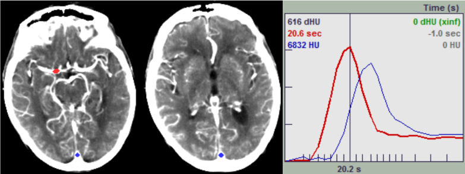

 
<p align="center"></p>

# How to: Annotate AIF/ VOF in CTP using HiPerGator
```
The following scripts are adapted and modified from Ruogu Fang's pct toolbox.

Added
-pct_aifvofautoselect (from pct_aifsearch.m)
-pct_aifvofmanualselect (combines pct_aifsearch.m and pct_vofsearch.m)
-pct_vofsearch (from pct_aifsearch.m)

Modified
- pct_aifsearch
- ct_annotation.m (from gen_PMs_ori_v3.m)
```

The purpose of this guide is to introduce how to annotate the arterial input function (AIF) and venous input function (VOF) in temporal computed tomography perfusion (CTP) data on HiPerGator (HPG). HPG is required to complete this tutorial. Our annotation method is currently a semi-automatic method that will need your manual verification and correction (Fig.1). All results and progress will be recorded in the Google Sheets. You must have the requirements listed below to continue. This tutorial requires you use HPGs Open OnDemand service. You may need the UF VPN if you are accessing this off-campus.

-	Request a HiPerGator account. [Link](https://www.rc.ufl.edu/get-started/hipergator/request-hipergator-account/)
-	Register for an IRB account. [Link](https://my.irb.ufl.edu/UFLIRB/sd/Rooms/DisplayPages/LayoutInitial?Container=com.webridge.entity.Entity%5bOID%5bAC482809EC03C442A46F2C8EEC4D75D3%5d%5d)
-	Complete UF IRB training. [Link](https://irb.ufl.edu/index/requiredtraining.html)
-	**Complete the standalone annotation training.**

Optional: Download the UF VPN [Link](https://it.ufl.edu/ict/documentation/network-infrastructure/vpn/)
 
<p align="center"><br/><i>Fig 1. Current pipeline for MAGIC annotation. The boxes in grey are covered in this tutorial.</i><p>

The standalone annotation training will help you practice proper annotation methods. The training consists of 10 training subjects and 10 examples from the RAPID software. Training will be verified by the main coordinator. Once you complete the training, you will have access to the Google Sheets where you can continue annotation.
________________________________________

If you are new to HiPerGator, these resources may help.
-	Learn basic shell commands. [Link](https://www.educative.io/blog/bash-shell-command-cheat-sheet)
-	Learn about HiPerGator’s resources. [Link](https://help.rc.ufl.edu/doc/Getting_Started)
-	HiPerGator training. [Link](https://help.rc.ufl.edu/doc/New_user_training)
-	HiPerGator Open OnDemand [Link](https://help.rc.ufl.edu/doc/Open_OnDemand) 


## Section 1a: Finding the AIF/VOF
In this section, we use anatomical guides to find the AIF and VOF in the brain. There are many axial slices we can use to find them. The main criteria we use to evaluate proper AIF/VOF is the time-concentration curve. The time-concentration curve is a graphical representation of the concentration of the contrast agent in a specific region of interest (ROI) over time. There are many arteries and veins we can use to find AIF/VOF. However, there are consistent anatomical structures we can use to guide our search.
 
<p align="center"><br/><i>Fig 2. Example of AIF/VOF from our automatic selection.</i><p>


To understand how to find the curves we first need to understand how to read CT images. CT images are acquired by using x-rays to generate cross-sectional, two-dimensional images of the body. The x-ray projections are reconstructed to generate the structural images of the body. Each pixel in a CT image is assigned a CT number which corresponds to its attenuation value. The attenuation value is a measure of the radio density of a specific tissue or material. This value is compared to the attenuation value of water on a scale of arbitrary units named Hounsfield units (HU)(Fig.3). More negative values such as air show up darker. Higher values such as bone show up brighter. In CT perfusion maps we look for the bright regions excluding bone. The injected contrast shows up bright in the CT scan which allows us to look at the vascular structure of the brain and to more easily identify any abnormalities. Contrast agents typically contain high concentrations of iodine, which strongly absorbs x-rays.
 
<p align="center"><br/><i>Fig 3. Hounsfield unit scale.</i><p>

The arterial input function (AIF) is defined as the concentration of the contrast medium in an artery measured over time in a region of interest. Contrary to the time-concentration curve seen in Fig.2, the curve is generally higher, faster, and earlier than the VOF. The curve seen in Fig.2 can be explained by the partial volume effect. This occurs when a voxel contains a mixture of two or more different materials with different attenuation values. The ideal AIF we can find is anterior to the lateral ventricle’s frontal horn and corpus callosum and posterior to the inter-hemispheric fissure (Fig.5). The artery we choose here is the anterior cerebral artery (ACA), which shows up fairly well in our scans. We can refer to this as the ACA target.
There is another area you can find the AIF. However, this is not as consistent as the previously mentioned AIF. You may see this in the RAPID example. The red dot in Fig.4 shows the A2 segment in the internal carotid artery (ICA) terminus. This selection is lateral to the midline of the brain. It produces a very accurate AIF curve compared to the ACA target but is unreliable to target with automatic annotation. We can refer to this as the A2 target.
 
<p align="center"><br/><i>Fig 4. Example of the AIF found in the A2 target.</i><p>


The venous output function (VOF) is defined as the concentration of the contrast medium in a vein that drains over time in a region of interest. The time-concentration curve is generally slower and delayed. The ideal VOF we can find is located at the superior sagittal sinus. The superior sagittal sinus is a large structure that is situated in the longitudinal cerebral fissure. This can easily be spotted posterior with an obvious large white spot. We can refer to this as the SSS (superior sagittal sinus) target.
 
<p align="center"><br/><i>Fig 5. Example locations of the AIF/VOF. The ideal AIF is located anterior to the corpus callosum and lateral ventricles, and posterior to the inter-hemispheric fissure. The ideal VOF is located posterior at the superior sagittal sinus.</i><p>

## Section 1b: Setup (One-time)
In this section, we will setup the work environment. We will use the Open OnDemand service provided with HPG to access the tools we need. We will copy the necessary files to process and annotate the data.
1.	Navigate to Open OnDemand or type ood.rc.ufl.edu in the address bar.
2.	Click on the Interactive Apps tab and select MATLAB.
3.	Use the following fields to launch MATLAB.

|GENERAL FORM FIELDS |	MATLAB |
|-----|-----|
|Number of MPI Tasks |	----- |
|MATLAB version|	R2022a|
|Number of CPU cores| 	2|
|Maximum memory (GB)|	20|
|Time Requested (hrs)|	12|
|Cluster partition|	hpg-default|
|SLURM Account|	ruogu.fang|
|QoS|	ruogu.fang|
|Generic Resource Request|	-----|
|Additional SLURM Options|	-----|

Table 1. General form fields for OOD MATLAB

4.	Open a Terminal by clicking the top-left Applications button.
5.	Replace USER with your HPG username and run the command below:
cp -R /red/ruogu.fang/kylebsee/MAGIC/AIF-VOF/ /blue/ruogu.fang/USER/
6.	Using MATLAB, change the address bar to /blue/ruogu.fang/USER/
Now your workplace in MATLAB is setup. Each time you open MATLAB, you should be in the correct directory and you have the necessary tools to start annotating CT images! The only windows you need to keep open is the MATLAB session and the Google Sheet. After the standalone training, simply move back up one directory.
 
## Section 2: Standalone Training (One-time)
In this section, we will complete the standalone training. One of the folders copied from section 2 should include the standalone training. Here we will simply annotate the AIF/VOF of 10 subjects. The results will then be verified by the main coordinator of the annotations. All annotations will follow the ACA and SSS targets (refer to section 1a). The standalone training includes the following:
•	Scripts containing code for annotation. This version only contains the manual annotation.
•	An excel sheet which follows the same structure as the Google Sheets.
To begin, follow the steps to complete training.
1.	Open a session of OOD MATLAB.
2.	Open the ct_annotation_practice.m code and the excel sheet.
3.	Replace the Patient ID with a subject number found in the excel sheet.
4.	Manually annotate each subject and record coordinates.
5.	Once complete, notify the main coordinator. 

## Section 3: Annotating CTP
In this section, we need both a HPG session and the Google Sheets open. Below is a quick rundown of the steps for annotating. This will closely follow the steps performed in the standalone training. The only changes are the addition of the upfront automatic selection along with using Google Sheets instead of the provided excel sheet. Following the outline is a detailed description of the process.
1.	In Google Sheets, look for a subject that is deidentified and has CT. Make note of the subject ID.
2.	In MATLAB, copy the subject ID to the patient ID variable.
3.	Run the code and follow the prompts.
    -	[Optional] Choose to overwrite the current file
    -	Choose to accept or reject the automatic annotation
    -	Manually select the AIF
    -	Manually select the VOF
    -	Choose to accept or reject your manual annotation
4.	Record your results in the Google Sheet.
    -	The name of the annotator
    -	XYZ coordinates of the AIF/VOF
    -	Whether a manual correction was needed
    -	Time spent on annotation

A description of the annotation code. You will be prompted with a window showing an automatic selection of the AIF/VOF locations. A window will pop-up above asking if you would like to keep the selection. Make a choice depending on the quality of the AIF/VOF curve. If you accept the selection, the image will be saved under the subject ID’s folder. If you decline the selection, you will be redirected to make your own selection.
The figure below shows the following prompts if you decline the automatic selection. You will first select the AIF. Then the curve and your click will be shown in another window. A second prompt will ask if you want to keep the curve. If you decline, you will re-select the AIF. When you accept, you will move to the VOF.
 
<p align="center"><br/><i>Fig 6. Manual selection of the AIF.</i><p>

The figure below shows the following prompts once you select the AIF. You will now select the VOF. The VOF curve and your click will be shown in another window. A third prompt will ask if you want to keep the curve. Your previously selected AIF will also be shown. If you decline, you will re-select the VOF. When you accept, you will review your selection. 
 
<p align="center"><br/><i>Fig 7. Manual selection of the VOF.</i><p>

Once you have selected your AIF and VOF, a final review screen will be displayed. This will be similar to the automatic selection in the beginning. You will have a chance to re-do your manual selection by selecting No on this fourth prompt.
 
<p align="center"><br/><i>Fig 8. Confirmation of the AIF/VOF.</i><p>

Once you complete your selection, the rest of the information will show up in the command window. The coordinates for the AIF and VOF can be copy and pasted directly into the Google Sheet. Paste the coordinates into the X AIF column and select the split text to columns option to quickly split the coordinates. Each coordinate should end up in their respective places.
 
<p align="center"><br/><i>Fig 9. AIF/VOF coordinate results.</i><p>

If you need to re-do your selection afterwards or there is an existing file in the folder, a prompt will give a few options when you first run the code. You can choose to overwrite the existing annotation which will delete the current annotation and run the code normally. You can choose delete to simply delete the annotation and skip the annotation process. You can choose skip and nothing will happen.

<p align="center"><br/><i>Fig 10. File detected window.</i><p>

How does the automatic ROI code work? There are a few extra options available to change if needed. These are the slice and ROI variables found under the patient ID variable. A higher slice number up to 320 is superior while lower slice numbers down to 1 are more inferior. The ROI variables can be changed but will generally be in the same area. Otherwise, manual correction is normally performed. If you need to adjust the ROI for any reason, the ROIs work like this. The red boxes in Fig.11 show the coordinates for the AIF ROI. In the code, the ROI is set using [ X1, Y1, X2, Y2 ].
 
<p align="center"><br/><i>Fig 11. Example of ROI coordinates used in automatic selection.</i><p>


